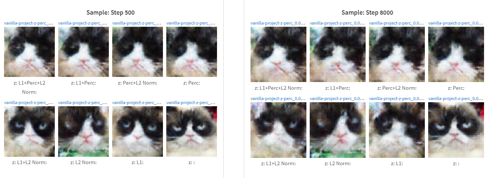
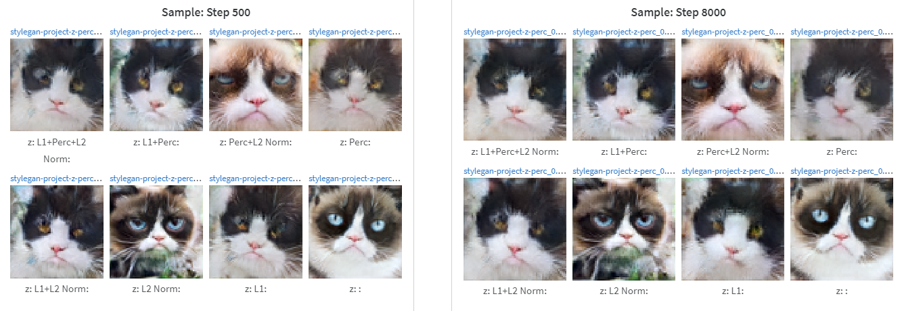
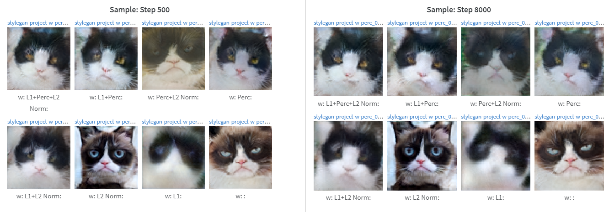
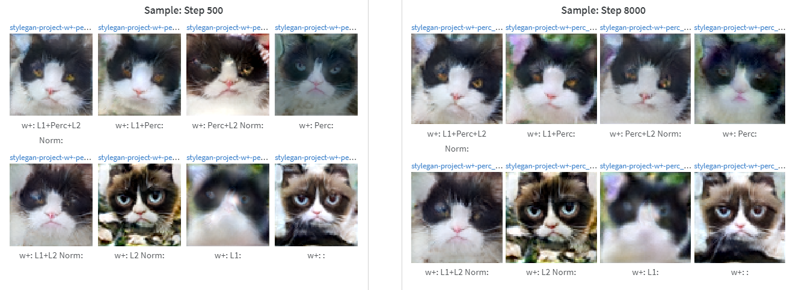
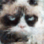
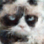

# 16726_p5

## 1. Generator inversion

We compare
- StyleGAN (z, w, w+) vs Vanilla GAN (z)
- From our experiments with StyleGAN in HW4, we judge the default of conv_5 perceptual loss to be reasonable, so we directly compare combinations of Lp (L1), perceptual loss, and L2 of delta regularization. We also note initializing from an average of many samples hurts performance, especially for Vanilla GAN, which barely starts learning, so we keep this option off.

We compare latent/model combo at a time, across hyperparameters (2^3 choices of losses to include). We first note early and final results. The wandb report is [here](https://wandb.ai/joelye9/16726_p5/reports/Part-1-Inverse-Projection--Vmlldzo0MDc1NjE3). The loss hyperparameters are
```
- Lp/L1 (default weight 10)
- Perceptual (default weight 0.1)
- L2 norm (tuned to 1e-3 in early exps)
```

### Target Image


### Vanilla: Z


### StyleGAN: Z



### StyleGAN: W



### StyleGAN: W+




### Commentary
Universally, results are not good without perceptual loss -- the second row is always less faithful than the first. Including L1 loss on top of this improves convergence rates - the first two images of each group are pretty close to the rigth result. L2 norm has the expected effect of subduing some of the green background, though cat likeness is not obviously affected.

Vanilla GAN converges very rapidly, interestingly, but the quality is not good.


## 2. Interpolation
We trim hyperparameters to now include both losses all the time, but do still toggle regularization. We show no regularization, and then with regularization try the four models.

### Vanilla: Z





The interpolation does still appear to work in so far as the in-between samples are still reasonable cat samples for the Vanilla GAN.  Minimal perspective shifting ibilities.

### StyleGAN: Z


The interpolation transitions unsatisfactorily for the first pair, particularly when the blue eyes must warp out of existence. Regularization doesn't seem to have a major effect on this.

### StyleGAN: W


The first pair still has a pretty unsatisfactory interpolation.  Really, the onset of the second image is sudden, it doesn't appear like a continuous change.

### StyleGAN: W+


Better than the rest. The onset of the second image appear to lapse over more samples, which is something.

## 3. Scribbles

